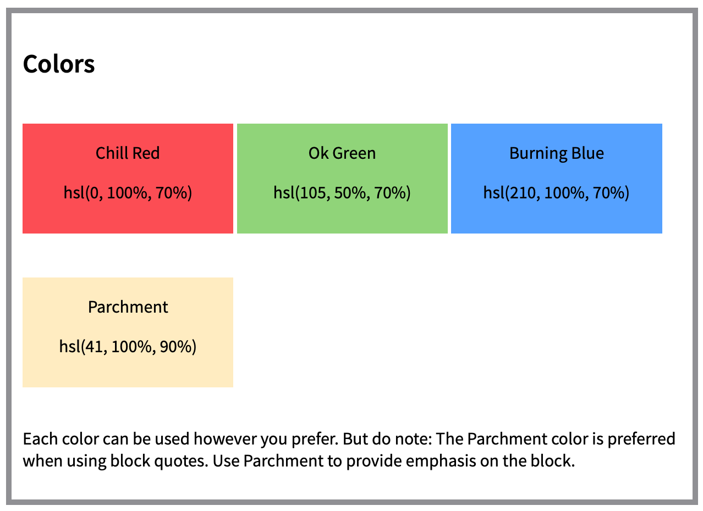
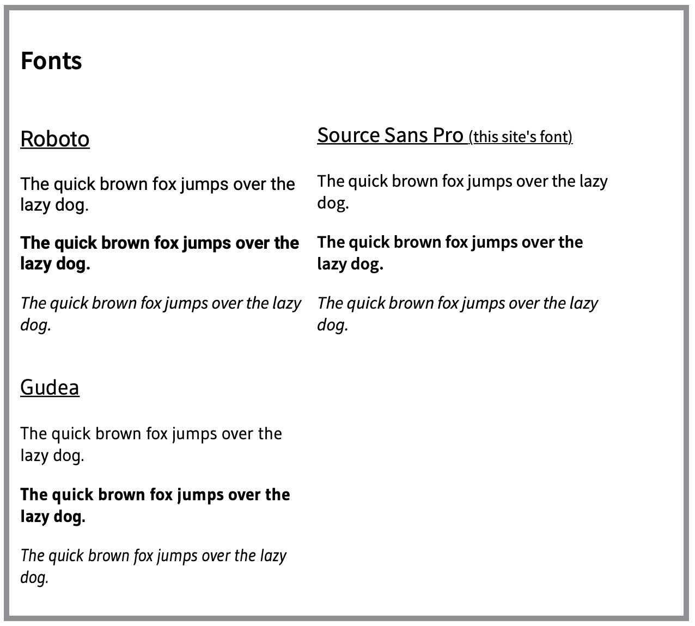
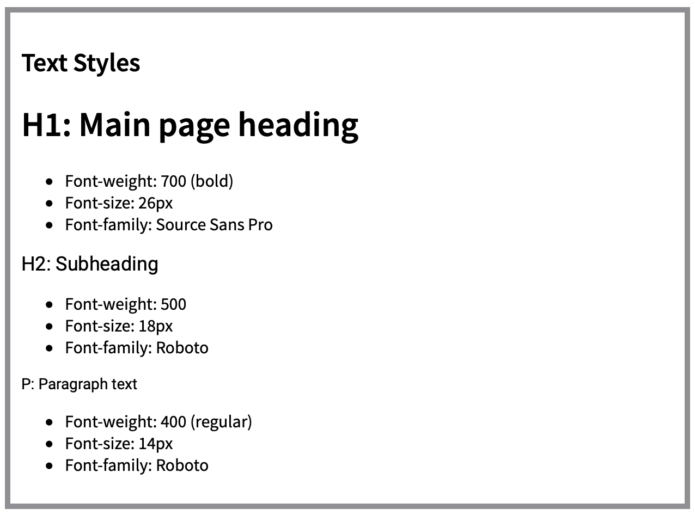

# Website Style Guide

This is just a simple style guide created using Codecademy's Web Development Career Path

## Color Section

A sample of preferred colors to use on an example website.

## Fonts Section

A sample of the different fonts available for the site.

## Text Styles

The specifications for which font to use for which section.

